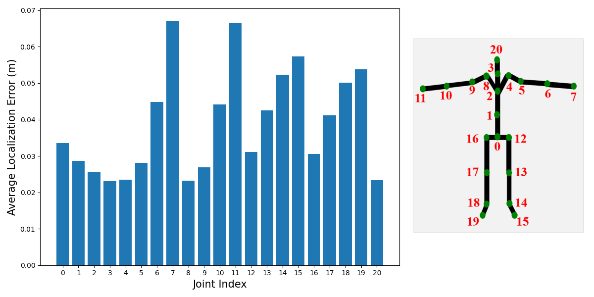
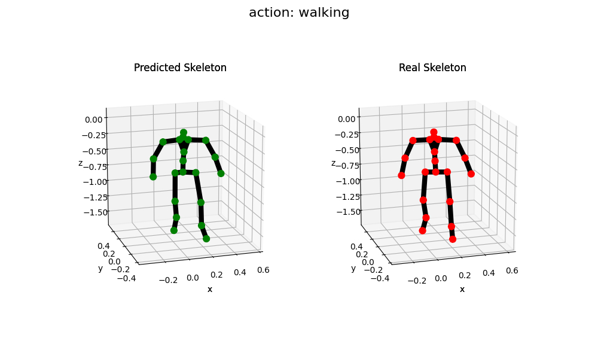
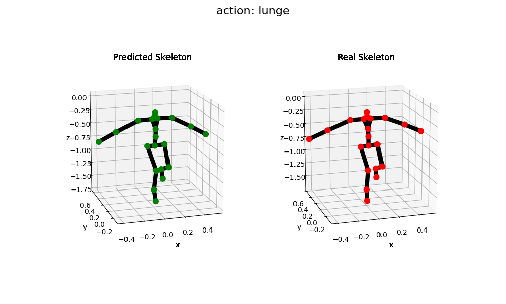
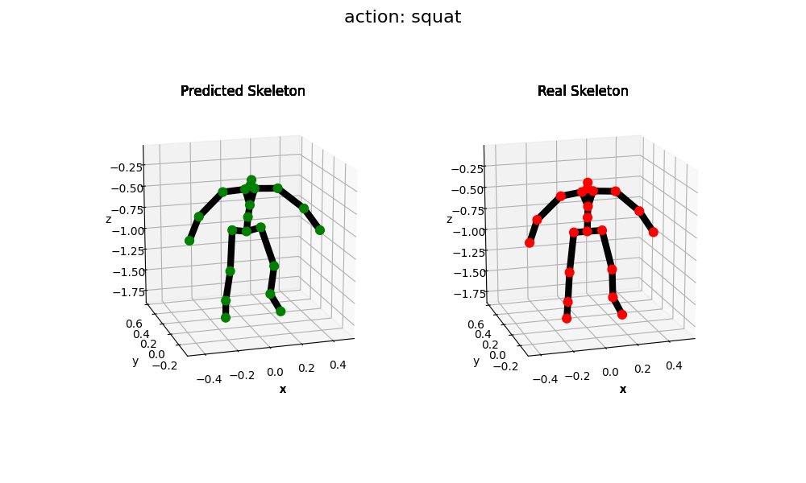

## Introduction：

This repository holds the codebase, dataset and models for the paper:

**Egocentric Human Pose Estimation using Head-mounted mmWave Radar**.

The structure of the repository is listed as following:

```
|-- Config
|   |-- config.py
|   |-- config_demo.py
|-- Net
|   |-- GCN.py
|   |-- IMU_Net.py
|   |-- Lower_Net.py
|   |-- Upper_Net.py
|-- Processor
|   |-- Test
|   |   |-- Demo_test.py
|   |-- Train
|       |-- Train_IMU.py
|       |-- Train_Lower.py
|       |-- Train_Upper.py
|-- Resource
|   |-- Img
|   |-- Pretrained_model
|       |-- IMU_Net
|       |-- Lower_Net
|       |-- Upper_Net
|   |-- Sample_data
|-- Util
|   |-- Universal_Util
|   |   |-- Dataset.py
|   |   |-- Dataset_sample.py
|   |   |-- Dataset_action.py
|   |   |-- Utils.py
|   |   |-- Utils_demo.py
|   |-- Visual_Util
|       |-- draw3Dpose.py
|-- main.py
|-- README.md
|-- requirement.txt
```

## Visualization：

Todo

## Requirements:

- Python3 (>3.5)
- PyTorch
- Other Python libraries can be installed by `pip install -r requirements.txt`

****Tips:** If you cannot set up the environment locally, you can use the Google's Colab service to run
this [notebook](https://colab.research.google.com/drive/1Y8gPFRGWQudmVw7DBKW0JkgehBoV7BoH?usp=sharing).**

## Installation:

``` shell
git clone https://github.com/yenanjing/mmEgo_Rev.git
```

## Data:

The pre-processed data for training and testing is stored in the `Resource/Sample_data` directory, which includes 13 actions
collected in the paper.  

The data structure is as follows: 
```
|-- Action: 01
|   |-- 03
|       |-- ti_imu_key_003.mat
|       |-- ...
|       |-- ti_imu_key_096.mat
|   |-- 04
|   |-- ...
|   |-- 20
|-- 02
|-- ...
|-- 13 
```
At the top-level, there are 13 folders, each of which contains data of a specific action. Each action folder has 18 subfolders containing 18 snippets of the action. In a snippet, the action is repeated for 10 seconds. Each .mat file stores one frame of mmWave point cloud, IMU data,
and ground truth.

## Test:

### Quantitative results

You can use the following command to run the test with our pretrained model. The results are the average ioint localization error of all test samples.

```shell
python main.py --infer
```

Expected Terminal Output as follows:

```shell
data load end
835it [00:28, 29.50it/s]
Average Joint Localization Error(cm): 3.893234612654426
Average UpperBody Joint Localization Error(cm): 3.507117400849294
Average LowerBody Joint Localization Error(cm): 4.487715154930861
Average Joint Rotation Error(°): 5.3738645146242865
Per Joint Localization Error(cm): [3.35941255 2.87198341 2.56157758 2.30499098 2.34241374 2.80576303
 4.48244299 6.71278707 2.31875466 2.69022188 4.41651893 6.65339315
 3.10652336 4.25521534 5.23230264 5.73526735 3.0540133  4.12044566
 5.01231217 5.38564139 2.33594403]
```

And the plot window displaying the error bar chart for each joint, is as follows:
<p align="center">
    
</p>

### Qualitative results

You can use the following command to visualize the pose estimation results.

```shell
python main.py --infer --vis
```

The expected output is a comparison between the predicted skeleton (In Green) and the ground truth skeleton (In Red) for each frame. We also demonstrate the correpsonding the video the action. 

<table style="width:100%; table-layout:fixed;">
<tr>
    <td> </td>
    <td> </td>
</tr>
<tr>
    <td> </td>
    <td> </td>
</tr>
<tr>
    <td> </td>
    <td> </td>

</tr>
<tr>
    <td> </td>
    <td> </td>

</tr>
<tr>
    <td> </td>
    <td> </td>

</tr>
<tr>
    <td> </td>
    <td> </td>

</tr>
<tr>
    <td> </td>
    <td> </td>

</tr>
<tr>
    <td> </td>
    <td> </td>

</tr>
<tr>
    <td> </td>
    <td> </td>

</tr>
<tr>
    <td> </td>
    <td> </td>

</tr>
<tr>
    <td> </td>
    <td> </td>

</tr>
<tr>
    <td> </td>
    <td> </td>

</tr>
<tr>
    <td> </td>
    <td> </td>

</tr>
</table>

[//]: # (<p align="center">)

[//]: # (    )

[//]: # (</p>)

## Train:

You can use the following commands to train the IMU_Net, Upper_Net, Lower_Net, respectively.

```shell
# train IMU_Net
python main.py --train --network IMU_Net [--log_dir ${INTEGER INDEX}]

# train Upper_Net
python main.py --train --network Upper_Net [--log_dir ${INTEGER INDEX}] [--load_IMU_path ${PATH_TO_MODEL}]

# train Lower_Net
python main.py --train --network Lower_Net [--log_dir ${INTEGER INDEX}] [--load_IMU_path ${PATH_TO_MODEL}] [--load_Upper_path ${PATH_TO_MODEL}]
```

The intermediate results and models generated during training are by default saved in `Processor/Train/model/{index}`,
`Processor/Train/lossAndacc/{index}`, and `Processor/Train/report/{index}`. You can modify the training parameters such
as ```num_epoches```, ```batch_size```, ```lr``` and ```device``` in the command line or configuration files. The order
of priority is:  command line > config file > default parameter. For more information, use ```python main.py -h```.

For any question, feel free to contact.
